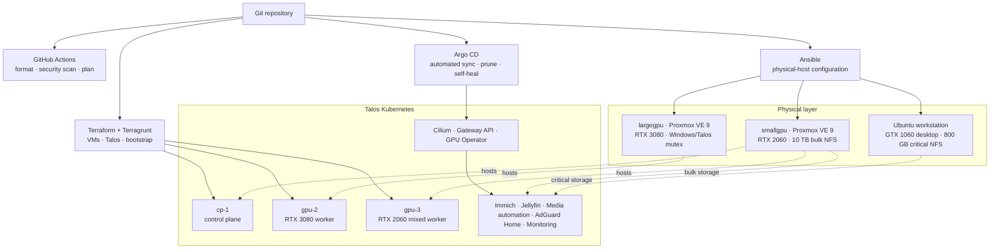
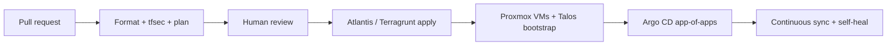

# Homelab — GitOps Kubernetes on Proxmox

<div align="center">

**A production-minded Kubernetes platform built from repurposed hardware.**

Talos Linux · Proxmox VE · Terraform/Terragrunt · Ansible · Argo CD · Cilium


</div>

This repository is the source of truth for my homelab: physical-host
configuration, virtual machines, a Talos Kubernetes cluster, networking,
storage, GPU workloads, observability, and self-hosted applications. The goal
is not simply to run services at home, but to operate a small platform with the
same practices I would bring to a production environment: clear ownership,
reviewable infrastructure changes, immutable nodes, GitOps reconciliation,
explicit recovery procedures, and documented trade-offs.

## At a glance

| | |
|---|---|
| **Compute** | Two Proxmox VE hosts and one Ubuntu workstation |
| **Kubernetes** | Talos Linux with one control plane and two GPU-capable workers |
| **Accelerators** | NVIDIA RTX 3080 and RTX 2060 passed through to Talos VMs |
| **Storage** | 10 TB bulk tier, 800 GB critical-data tier, and disposable local GPU scratch |
| **Networking** | Cilium CNI, Gateway API, LAN load-balancer IPs, Tailscale, and Cloudflare Tunnel |
| **Delivery** | Terraform/Terragrunt for infrastructure and Argo CD for continuous reconciliation |
| **Operations** | Ansible-managed hosts, Prometheus, Alertmanager, Grafana, runbooks, and PR plans |

## Architecture



The platform is intentionally split into three ownership layers:

1. **Ansible owns physical hosts** — Proxmox repositories, storage, NFS,
   backups, UPS integration, and VFIO prerequisites, plus the Ubuntu NFS
   workstation.
2. **Terraform/Terragrunt owns virtual infrastructure** — Proxmox VMs, PCIe
   passthrough, Talos machine configuration, cluster bootstrap, Cilium, and the
   initial Argo CD installation.
3. **Argo CD owns in-cluster workloads** — applications, platform controllers,
   routes, and static storage resources continuously reconciled from Git.

This boundary prevents two tools from trying to manage the same resource and
makes failures easier to reason about.

## What the lab runs

| Capability | Implementation | Why it is here |
|---|---|---|
| Private photo platform | Immich with PostgreSQL and Redis | A real stateful workload whose irreplaceable data must stay on permanent hardware |
| Personal job assistance | Python, PostgreSQL, Telegram, Codex CLI | Human-approved discovery and truthful CV/outreach preparation without bulk applications |
| Home streaming | Jellyfin, Seerr, Servarr, Bazarr, qBittorrent, and Maintainerr | GPU-accelerated streaming with automated subtitles, recoverable bulk media, and policy-driven retention |
| Observability | kube-prometheus-stack, Grafana, Alertmanager, and NVIDIA DCGM metrics | Cluster, workload, and GPU visibility with explicit retention limits |
| Private DNS | AdGuard Home | Split DNS for private services and optional network-wide filtering |
| Private remote access | Official Tailscale subnet router | Administrative access without exposing management interfaces publicly |
| Public application access | Cloudflare Tunnel | Outbound-only application publishing with no router port forwarding |
| GPU scheduling | Talos NVIDIA extensions and NVIDIA GPU Operator | CUDA workloads, device discovery, validation, and GPU telemetry |
| Windows gaming | Separate Terraform stack with an RTX 3080 runtime mutex | Demonstrates safe sharing of constrained physical hardware between workloads |

## Engineering highlights

- **Immutable Kubernetes nodes.** Talos has no general-purpose shell or SSH
  surface; machine configuration and upgrades are API-driven and reproducible.
- **GPU passthrough across layers.** Ansible prepares VFIO on the host,
  Terraform attaches PCIe devices to the correct VM, Talos supplies the
  version-matched NVIDIA extensions, and GPU Operator exposes the devices to
  Kubernetes and Prometheus.
- **Data placement follows failure domains.** Personal data uses the permanent
  Ubuntu workstation. Reproducible media and metrics use the larger borrowed
  host. GPU caches use disposable node-local scratch.
- **Safety is designed in.** Host playbooks validate hardware and filesystems,
  do not format disks, serialize changes, and keep reboots explicit. Static
  Kubernetes volumes use the `Retain` policy.
- **Pull requests show infrastructure impact.** CI checks formatting, runs a
  security scan, and posts Terragrunt plans; Atlantis requires an approved,
  mergeable PR before apply.
- **Recovery knowledge lives beside the code.** Operational runbooks document
  enrollment, verification, failure modes, and recovery rather than relying on
  memory.

## From commit to cluster



Infrastructure changes and application changes have different deployment
paths. Terraform creates the platform and bootstraps Argo CD; after that, Argo
CD watches [`kubernetes/apps/`](kubernetes/apps/) and reconciles the resources
under [`kubernetes/system/`](kubernetes/system/).

## Deliberate trade-offs

| Decision | Trade-off |
|---|---|
| Single control plane | Fits the real memory and failure-domain constraints, but control-plane maintenance causes downtime |
| Static NFS volumes | Simple and transparent data placement, but no dynamic provisioning and the server remains a dependency |
| Borrowed GPU hosts | Adds substantial compute capacity, but only reproducible data may depend on those machines |
| RTX 3080 shared by Talos and Windows | Maximizes hardware use, but only one VM can own the GPU at a time |
| Public Git repository | Makes the architecture reviewable; plaintext credentials and generated access files stay out of Git, while recovery material is committed only as SOPS/age ciphertext |

These constraints are documented rather than hidden. The target for future
high availability is three control-plane nodes across distinct physical hosts
once the hardware and memory budget support it.

## Repository tour

```text
.
├── ansible/                  Physical Proxmox and Ubuntu configuration
│   ├── inventory/production Hardware-specific desired state
│   ├── playbooks/            Configure, verify, and explicit reboot entry points
│   └── roles/                NFS, storage, backup, UPS, repositories, and VFIO
├── terraform/
│   ├── deployments/          Environment and stack composition with Terragrunt
│   └── modules/              Talos cluster, Proxmox VM, and Windows VM modules
├── kubernetes/
│   ├── apps/                 Argo CD Application manifests (app-of-apps)
│   └── system/               Workloads, networking, monitoring, and storage
├── secrets/                  SOPS-encrypted disaster-recovery material
├── scripts/secrets.sh        Capture, validate, and restore encrypted secrets
├── docs/                     Architecture notes and operational runbooks
├── .github/workflows/        Pull-request checks and infrastructure plans
└── atlantis.yaml             Reviewed Terragrunt plan/apply workflow
```

### A five-minute technical tour

1. Start with the detailed [architecture and design decisions](docs/architecture.md).
2. See the production node model in
   [`terraform/deployments/prod/config.yml`](terraform/deployments/prod/config.yml).
3. Follow VM creation through Talos bootstrap, Cilium, and Argo CD in
   [`terraform/modules/stacks/homelab-cluster/main.tf`](terraform/modules/stacks/homelab-cluster/main.tf).
4. See the GitOps app-of-apps pattern in [`kubernetes/apps/`](kubernetes/apps/).
5. Review the guarded delivery pipeline in
   [`.github/workflows/terraform-plan.yml`](.github/workflows/terraform-plan.yml)
   and [`atlantis.yaml`](atlantis.yaml).

## Documentation

| Document | Focus |
|---|---|
| [Architecture](docs/architecture.md) | Hardware, topology, networking, storage, Terraform modules, CI/CD, and design rationale |
| [Secrets disaster recovery](docs/secrets-disaster-recovery.md) | SOPS + age setup, capture, rotation, validation, and bare-metal recovery |
| [Kubernetes network policies](docs/network-policies.md) | Default-deny application isolation, allowed-flow matrix, exceptions, and rollout verification |
| [Remote access](docs/remote-access.md) | Public Cloudflare routes, private Tailscale access, and security boundaries |
| [Tailscale runbook](docs/tailscale-runbook.md) | Subnet-router enrollment, route approval, client setup, and troubleshooting |
| [AdGuard Home runbook](docs/adguard-home-runbook.md) | Private split DNS, tailnet filtering, setup, and recovery |
| [Monitoring runbook](docs/monitoring-runbook.md) | Prometheus/Grafana deployment, storage, access, and verification |
| [Job assistant architecture](docs/job-assistant-architecture.md) | Trust boundaries, queues, state machines, deduplication, and delivery safety |
| [Job assistant runbook](docs/job-assistant-runbook.md) | Private inputs, Codex auth, secrets, deployment, restore, and troubleshooting |
| [GPU Operator runbook](docs/gpu-operator-runbook.md) | Talos NVIDIA prerequisites, rollout, CUDA validation, and metrics |
| [Jellyfin media stack runbook](docs/media-stack-runbook.md) | Backup restoration, storage, GPU transcoding, credential rotation, and cleanup policy |
| [Ubuntu workstation runbook](docs/ubuntu-workstation-runbook.md) | Critical NFS service and local NVIDIA/HDMI recovery |
| [Physical-host automation](ansible/README.md) | Ansible prerequisites, safety behavior, tags, backups, NFS, UPS, and VFIO |

## Security note

Secrets are supplied at runtime through a gitignored `.env`, CI secret stores,
and manually created Kubernetes Secrets. Their disaster-recovery copies are
SOPS-encrypted to an age identity whose private key is itself protected by a
human-held passphrase. Only ciphertext is committed. Kubeconfig, plaintext age
keys, Talos access files, Terraform state, and generated plans remain excluded
from version control. See the [secrets recovery runbook](docs/secrets-disaster-recovery.md).
