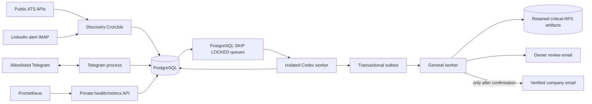
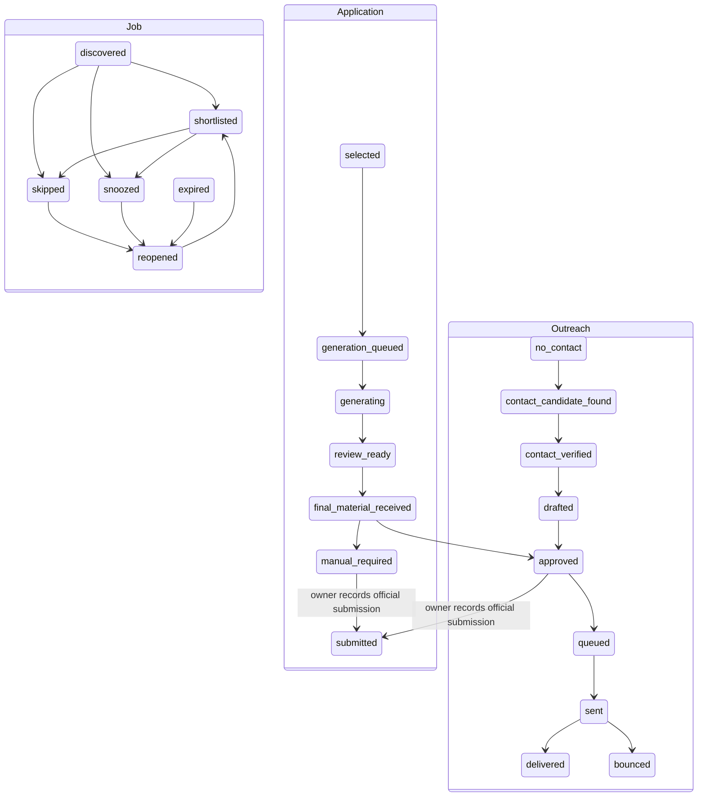

# Job assistant architecture

## Boundaries and data flow

The system is one codebase and one container image, but its deployment splits
credentials by role. The Codex worker has no Telegram token, SMTP credential,
Kubernetes API token, or public-delivery capability. The general worker has no
Codex authentication. All workloads disable the default service-account token.

Job pages, HTML, and alert emails are untrusted. HTML is stripped of active and
remote content before storage. The Telegram process creates a sanitized prompt
payload from only the bounded job fields and validated career inventory before
queueing generation. Codex runs in an ephemeral session, read-only sandbox,
with no artifacts/private-data mount, user configuration ignored, web search
disabled, an explicit timeout, and a JSON Schema output contract. Output fails
closed if any claim references a career-inventory ID that does not exist.

## Persistence and reliability

PostgreSQL stores normalized jobs, occurrences, scores, contacts, application
state, append-only transition events, queue leases, outbox events, and delivery
attempts. Binary CVs are versioned on critical NFS and represented in the
database by key, MIME type, size, and SHA-256 digest.

Deduplication is ordered and conservative:

1. `(source, external_job_id)`
2. ATS job ID
3. canonical URL without tracking parameters
4. exact normalized-description hash
5. a recorded fuzzy duplicate candidate

Fuzzy candidates are never silently merged. Unique constraints protect every
idempotency key and suppress duplicate Telegram updates, applications,
generation runs, notifications, and application/contact sends.

For recruiter SMTP, the worker commits a `sending` reservation before the
network call. If it crashes in the uncertain interval after SMTP accepted the
message, recovery requires manual review; it does not retry and risk spam.
This yields at-most-once external outreach under SMTP's lack of a portable
idempotency API. Review notifications use bounded exponential retries.

## Independent state machines

Recruiter outreach never changes the application to `submitted`. Only the
owner's `/submitted CODE` command records completion of the official
application. Every transition is appended to `application_events` with actor,
time, aggregate, prior state, next state, and metadata.

## Storage and backup choice

Career facts, contacts, job history, Codex credentials, and generated CVs are
personal and irreplaceable. All four retained static PVs use `nfs-storage2` on
the permanent Ubuntu workstation. PostgreSQL logical backups share that failure
domain and protect primarily against logical mistakes; encrypted off-host
copies remain necessary. No automatic deletion is enabled: the backup CronJob
prints files older than 30 days and deletes only after the operator explicitly
sets `RETENTION_DELETE=true`.

The remaining limitation is bounce/delivery confirmation: ordinary Gmail SMTP
can report acceptance (`sent`) but not portable downstream delivery or bounce
events. The schema and provider boundary support later bounce ingestion; until
then `delivered` and `bounced` require an external integration or manual update.
