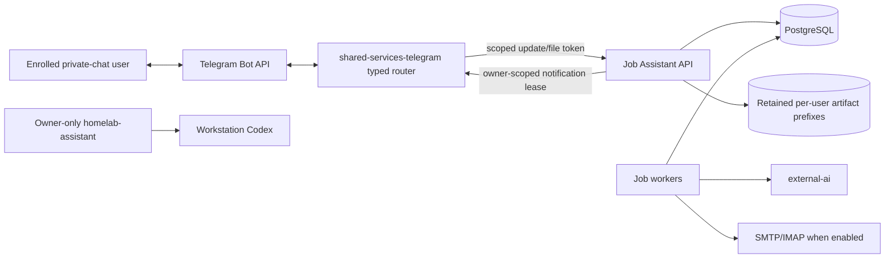

# Job Assistant and shared-services Telegram architecture

## Implemented boundary

The friend-shareable Telegram surface is a general, typed gateway in the
`shared-services-telegram` namespace. Job Assistant is its first registered
adapter. The gateway long-polls Telegram and creates no public ingress.

The existing Ansible-managed `homelab-assistant` on `ubuntu-workstation` is a
separate owner-only trust domain. It retains Codex/workstation and
infrastructure-control access. It has no route, token, credential, network
allowance, or fallback path for shared-service traffic and is unchanged by the
gateway implementation.

The gateway has only three secrets: its dedicated `TELEGRAM_TOKEN`, a Job
Assistant update/file token, and an independent notification token. It has no
service-account token, PVC, database credential, NFS mount, SMTP/IMAP or
external-ai secret, Codex/OpenAI material, host identity, or infrastructure
client. Adding another shared service requires a new typed adapter, command and
callback registry, scoped credentials, backend authorization, NetworkPolicy,
tests, and operator documentation. There is no generic proxy, webhook, shell,
or arbitrary dispatcher.

## Identity and ownership

`users.id` is an immutable internal UUID. `users.telegram_user_id` is a unique,
immutable positive numeric Telegram identity. Display name and username are
informational and grant no authority. Unknown, inactive, revoked, group,
channel, forwarded, sender-chat, and `from.id != chat.id` updates are silently
discarded by the gateway and checked again by the backend.

Public company, source, and job catalog rows may be shared. These records are
owner-scoped:

- applications, with uniqueness on `(user_id, job_id)` and a globally unique
  human code retained as defense in depth;
- scores, recommendations, skip/snooze/reopen feedback, and per-user job state;
- pending Telegram conversations and processed updates;
- contacts, application contacts, delivery attempts, artifacts, generation
  runs, work items, audit/application events, and notification outbox rows.
- confirmed search profiles, reminder preferences, setup/review conversations,
  follow-up dates, and discovery summaries.

Queries for codes, UUID callbacks, pending uploads, contacts, artifacts, and
notifications include the authenticated internal `user_id`. Composite foreign
keys bind application/contact child rows to the same user. A code, UUID,
callback payload, or storage key never conveys authority by itself.

Operator enrollment creates a random opaque storage prefix. Career inventory,
optional CV template, generated output, and final files live below that prefix.
Paths are composed only from the database prefix, application UUID, fixed kind,
and server-generated version; Telegram text and filenames cannot choose a
path. Inventories are validated per user immediately before generation and
included only in that user's generation work item.

Invited users default to `generation_enabled=false` and
`automated_delivery_enabled=false`. Enabling recruiter delivery additionally
requires a per-user review address and sender identity matching the configured
SMTP sender. Manual workflow remains available without enabling SMTP.

## Telegram protocol and reliability

The gateway registers gateway `/help` plus the Job Assistant `/job_*` command
set and known callback verbs. It acknowledges authorized callbacks promptly,
enforces Telegram's 64-byte callback limit, and forwards typed updates to the
backend, which remains authoritative for workflow rules and ownership.

The primary user surface is `/job_setup`, `/job_today`, and
`/job_applications`. Setup is a private 24-hour resumable draft with Back,
Keep, View, Reset, and Cancel controls; only Confirm Save writes the user's
profile. Recommendation and application callbacks carry a typed verb plus an
opaque UUID and remain below 64 bytes. Existing `/job_*` code-based commands
remain supported as a fallback.

Before any document download, the gateway calls the authenticated pending
upload endpoint. It accepts documents only, permits PDF/DOCX, enforces the
10 MB bound before and after download, and never downloads photos. Backend
content validation remains authoritative.

Generated PDF and DOCX review files use an authenticated, bounded pull
contract. A leased outbox event names one artifact UUID and public filename;
the API rechecks event state, recipient ownership, artifact ownership, MIME
type, stored size, actual size, and storage prefix before returning bytes. The
gateway repeats MIME/size checks and can only send that typed document to the
event's owning chat. Neither side exposes a storage key or path, and the
gateway has no artifact mount.

Telegram update IDs are persisted for idempotency. Async notifications are
leased from PostgreSQL. A definite Telegram failure enters bounded retry; a
timeout or transport failure after a possible send becomes `uncertain` and is
not automatically replayed. An expired Telegram lease also becomes
`uncertain`, while non-Telegram leases remain retryable. This prevents blind
duplicate messages or documents after a gateway restart. Metrics contain only
outcome classes, never user identifiers or content.

## Ranking and guided lifecycle

Ranking is deterministic. Excluded titles/companies, job age, incompatible
known location, required technologies, known seniority, known timezone
difference, and known salary below the configured floor can exclude a job.
Title, evidenced required/preferred technologies, freshness, location,
seniority, language overlap, salary, preferred company, and bounded feedback
contribute only when their required normalized data exists. Missing publication
date, location, seniority, timezone, language, salary, or description is
reported as unknown and omitted from the weighted denominator; it receives no
invented penalty. A different salary currency is likewise unknown because the
service performs no implicit currency conversion. Score explanations list only
components that affected the score plus unknown criteria.

Internal application states retain their stable command/API values. Telegram
maps them to Drafting, Awaiting review, Ready to submit, Submitted, Interview,
Rejected, Offer, Withdrawn, Manual action required, and Failed. Outcome
transitions are explicit and audited. Official submission remains separate
from outreach. Generated CV acceptance or a validated replacement, explicit
message acceptance or replacement, a named user-verified contact, and an exact
final approval summary are required before outreach can be queued.

A daily CronJob creates owner-scoped reminders for stale generated drafts,
ready-but-unrecorded applications, submitted applications without later
outcomes, scheduled follow-up dates, and manual-action states. Application and
profile switches can snooze or disable reminders. Daily idempotency keys
deduplicate each user/application/type/window. Reminder code only writes
Telegram outbox notifications and cannot send email or submit an application.

## Network and storage

The gateway namespace is default-deny. Its only flows are:

| Direction | Destination/source | Port |
|---|---|---|
| Egress | cluster DNS | UDP/TCP 53 |
| Egress | `api.telegram.org` | TCP 443 |
| Egress | exact Job Assistant API pods in `job-assistant` | TCP 8080 |
| Ingress | monitoring namespace | TCP 8080 metrics |

There is no route to the Kubernetes API, LAN/workstation, homelab-assistant,
external-ai, PostgreSQL, NFS, SMTP/IMAP, Argo CD, or VM control services. Job
Assistant's API ingress admits only the exact gateway labels and monitoring;
the obsolete homelab-assistant Telegram allowance was removed.

Job Assistant retains static `nfs-storage2` PVs with `Retain` for PostgreSQL,
artifacts, backups, and legacy unmounted Codex home. Ansible declares the four
backing directories with PostgreSQL UID/GID `999:999` or application UID/GID
`10001:10001`, mode `0700`. Per-user separation is application/database
authorization, not cryptographic isolation from the homelab operator.

## Migration compatibility

Alembic revision `0003_multi_user_ownership` requires
`JOB_ASSISTANT_OWNER_TELEGRAM_USER_ID`. It deterministically creates the owner
UUID and storage prefix, backfills all existing rows, adds ownership foreign
keys and uniqueness, then makes required ownership columns non-null. It also
works on an empty database. Missing or invalid owner identity aborts before
ownership is installed.

Revision `0004_guided_workflow` adds confirmed per-user search profiles,
notification preferences, discovery summaries, explicit CV/message review
fields, follow-up controls, and interview/rejected/offer states. Existing rows
receive safe nullable review fields and reminders default enabled. The schema
keeps composite user ownership on the selected final artifact.

CV-to-career-inventory onboarding is intentionally deferred. A future version
must use the existing external-ai boundary, store extracted facts as an
unconfirmed proposal, preserve evidence labels and the prior inventory, and
require explicit confirmation before activation. Uploading a CV today never
changes the authoritative career inventory.

The committed career inventory remains in place. It is not used directly by
the multi-user runtime. Before rollout, the operator copies the private runtime
inventory into the deterministic owner prefix using the content-free procedure
in the runbook. Generation remains fail-closed until validation.

The gateway Argo CD Application is initially manual and its manifest uses the
explicit `release-required` sentinel. CI builds both containers and the first
release PR replaces that sentinel with the tested commit SHA. This avoids
pretending that an unpublished image exists and prevents Argo CD from starting
an invalid first poller.
