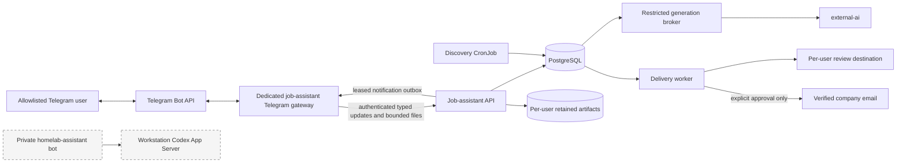

# Job assistant architecture

## Decision and migration status

The job assistant will use a dedicated Telegram bot. It will not share the
private `homelab-assistant` bot, its workstation Codex App Server, or its VM
actuator. This is the accepted target architecture; the current deployment
exposes the internal Telegram adapter but has no Telegram poller or gateway.
The private Home Assistant bot already has no job routing.

The dedicated bot is intended for a small, explicitly admitted group of
friends. It is not a public multi-tenant service. Telegram numeric user IDs,
not usernames, are the identities, and only private one-to-one chats are
accepted.

## Boundaries and data flow

The two Telegram surfaces are separate trust domains:

- `homelab-assistant` remains an administrator-only Ansible-managed service on
  `ubuntu-workstation`. It owns general Codex threads and deterministic homelab
  operations and has no job-assistant route or credential.
- `job-assistant-telegram` is an Argo CD-managed gateway in the
  `job-assistant` namespace. It owns only the dedicated bot token and scoped API
  client credentials. It has no database, NFS, SMTP, external-ai, Codex,
  Kubernetes API, or host credential.
- The job-assistant API remains the domain boundary. It validates membership,
  ownership, state transitions, uploads, and callbacks even when the gateway
  has already filtered the Telegram update.
- Workers retain their existing narrow roles. In particular, the delivery
  worker does not receive the bot token and the generation broker cannot call
  Telegram.

Long polling is preferred over a webhook because it creates no public ingress.
The gateway runs one replica with `Recreate`; PostgreSQL update IDs and
idempotency keys make restarts safe. It forwards normal updates to the existing
authenticated update endpoint, requests document bytes only for an active,
expected upload conversation, and leases and acknowledges asynchronous
notifications through the separate notification credential.

## Sharing and tenant ownership

The current schema is single-user: applications are unique by job, application
codes are not resolved with an owner, job feedback is global, and one career
inventory and review identity are mounted for every workflow. An allowlist by
itself therefore does not make the existing service safe to share.

Before admitting friends, the application model must provide these invariants:

1. A `users` record maps one active account to one immutable Telegram numeric
   user ID. Initial enrollment is operator-controlled; unknown and revoked IDs
   are silently ignored. Usernames and display names are informational only.
2. Jobs and companies may be a shared public catalog, but recommendations,
   skip/snooze state, search criteria, conversations, applications, contacts,
   delivery attempts, and audit actors are user-scoped.
3. An application is unique by `(user_id, job_id)`. Every code, callback, file
   upload, notification, and state transition is resolved with the acting
   `user_id`; possession of another user's human code is never sufficient.
4. Career facts, CV templates, generated files, and final files use per-user
   records and opaque storage prefixes. The API selects the path from the
   authenticated user record; no Telegram input may select an arbitrary NFS
   path.
5. Generation is disabled for a user until that user's career inventory has
   passed validation. One user's facts must never be used to generate another
   user's application.
6. Automated recruiter delivery is disabled for invited users by default.
   Enabling it requires a user-specific sender/review configuration and keeps
   the existing verified-contact, company-domain, explicit-confirmation, and
   duplicate-send protections. Manual outreach remains available without SMTP.

The API and discovery job must apply ownership predicates in their queries, not
only in the Telegram handler. Database constraints and tests must cover the
same boundaries so a future non-Telegram client cannot bypass them.

## Telegram trust and abuse controls

- Accept private chats only and require `message.from.id == message.chat.id`.
  Ignore groups, channels, forwarded identities, and non-members without
  revealing whether an ID is enrolled.
- Keep the dedicated `TELEGRAM_TOKEN` only in the gateway container. Never copy
  the Home Assistant bot token or the workstation bridge identity into
  Kubernetes.
- Restrict commands to the job workflow. Existing `/job_*` commands remain
  valid during migration; shorter aliases may be added later without claiming
  Telegram's root commands for the Home Assistant bot.
- Deduplicate updates before domain transitions, acknowledge callback queries
  promptly, and keep callback payloads opaque, bounded, and owner-checked.
- Check pending upload state before downloading a Telegram document. Preserve
  the existing PDF/DOCX MIME, structure, and 10 MB limits, and never accept
  photos as CV files.
- Apply per-user and global rate limits to updates, URL fetches, generation,
  and file storage. A noisy or compromised member must not exhaust the service
  for everyone else.
- Do not log bot tokens, raw updates, CV contents, job descriptions, generated
  output, email addresses, or Telegram profile data. Metrics use result classes
  rather than user IDs.

## Network and secret model

Default-deny policy permits only these new flows:

| Workload | Ingress | Egress |
|---|---|---|
| `job-assistant/telegram` | None | Cluster DNS, `api.telegram.org:443`, and `job-assistant/api:8080` |
| `job-assistant/api` | Telegram gateway and Prometheus to TCP/8080 | PostgreSQL, cluster DNS, and SSRF-filtered public job HTTP(S) |

The gateway receives `TELEGRAM_TOKEN`, `GATEWAY_API_TOKEN`,
`GATEWAY_NOTIFICATION_TOKEN`, and only the minimum bootstrap membership
configuration needed by the chosen enrollment flow. The API holds the matching
scoped tokens but not `TELEGRAM_TOKEN`. Token rotation can therefore replace
the public bot identity without changing database or model credentials.

No NetworkPolicy may grant the dedicated bot access to `external-ai`, the
workstation, the VM actuator, SMTP, NFS, or the Kubernetes API. Return traffic
for the API request and Telegram long poll is covered by Cilium connection
tracking; no inbound Service or Gateway route is created for Telegram.

## Reliability and delivery safety

- Work items, Telegram updates, outbox events, broker submissions, and external
  sends use unique idempotency keys.
- Generation runs persist the external job ID before workflow continuation.
- Async Telegram messages remain in the database outbox until the dedicated
  gateway leases, sends, and acknowledges them. A send whose outcome is
  uncertain is surfaced for review rather than blindly duplicated.
- Generated output must match the required JSON Schema and cite only the
  authenticated user's known career-inventory identifiers.
- Recruiter delivery and official application submission remain separate state
  machines with explicit human confirmation and duplicate-send protection.

No component treats model output, Telegram text, uploaded documents, or a job
description as executable authority. All runtime pods disable the default
service-account token.

## Storage

PostgreSQL, artifacts, private inputs, and backups remain on static, hard-bound
`nfs-storage2` volumes with `Retain`. User separation is enforced in the schema
and application paths; it is not a claim of separate cryptographic storage.
Friends must be told that the operator administers the database and underlying
NFS data.

External-ai's queue and Codex authentication remain on separate retained
volumes in its own namespace. The legacy job-assistant Codex-home volume stays
retained but unmounted during the external-ai recovery window.

## Migration gates

1. Add the user/ownership migration, per-user profile selection, and
   cross-user denial tests. Migrate the existing records to the owner's user ID
   before making the new columns non-null.
2. Add the dedicated stateless Telegram gateway and its unit tests using the
   existing authenticated API and notification lease/ack contracts.
3. Add the gateway-only Secret key and exact network policies. Verify the
   rendered manifests show no bot token in the API, worker, broker, discovery,
   or migration workloads.
4. Start the dedicated bot with only the owner admitted. Exercise updates,
   callbacks, bounded documents, notification retry/ack, and token rotation.
5. Remove the now-unused homelab-assistant ingress allowance and any retained
   job gateway credentials from the old Kubernetes recovery Secret, then verify
   that the two bots remain independent.
6. Add one test friend with generation and SMTP delivery disabled. Verify that
   both users are denied access to each other's codes, callbacks, files,
   recommendations, and notification recipients before admitting anyone else.

Never run two pollers with the same bot token. Rollback stops the dedicated
gateway and leaves Telegram job access unavailable; it must not route friend
traffic through the private Home Assistant bot or collapse friend-owned data
back into a single-user interface.
